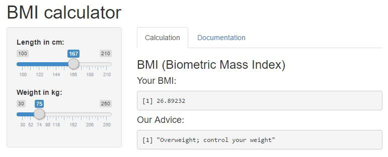
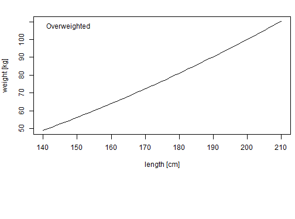

## Contents

1. Explanation of BMI 
2. The BmiMetric BMI calculator App
3. BMI advices

--- 

## Explanation of BMI

Obesity can be a major risk for diabetes, heart disease and death. 

The Body mass index (BMI) is the standard metric for determining who is normal-weight, overweight and obese.

BMI is a measure of body fat based on length and weight that applies to adult men and women. 

The formula is: $$BMI = \frac{weight[kg]}{(length[m])^2}$$

If your BMI indicates you are overweight, it is time for you to loose weight.

For more information: <a href='http://www.nhlbi.nih.gov/health/educational/lose_wt/BMI/bmi-m.htm'>US National Heart, Lung and Blood Institute</a>

---

## The BmiMetric BMI calculator App

Do you want to determine your BMI and get an usefull advice ?

"BmiMetric" is an easy-to-use BMI calculator APP developed with the Shiny platform

The BMI calculator can be found on <a href='https://hridder.shinyapps.io/bmimetric/'>https://hridder.shinyapps.io/bmimetric</a>



---

## BMI Weight 

A BMI Value of more than 25 determines if someone is overweighted. Useful information is a plot of the maximum weight by length.

A quick line plot for the maximum weight by length can be made in R with:
```
length <- (140:210)   # Length in [cm]
weight <- 25 * ((length/100)^2)
plot(length,weight)
```


